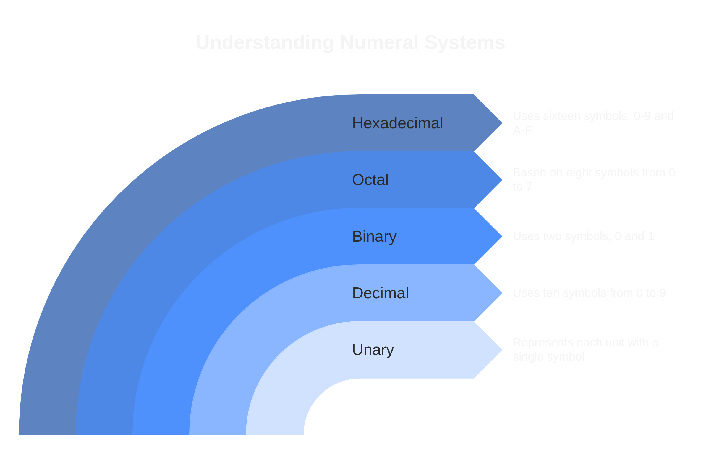
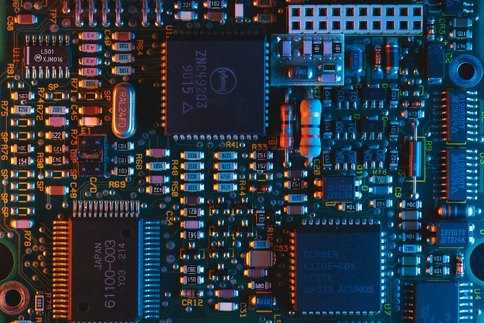
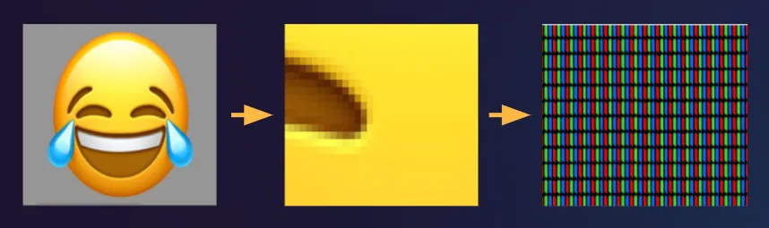
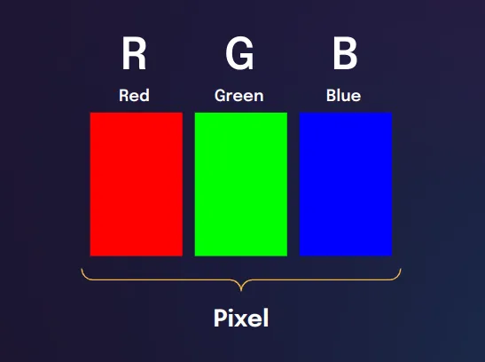
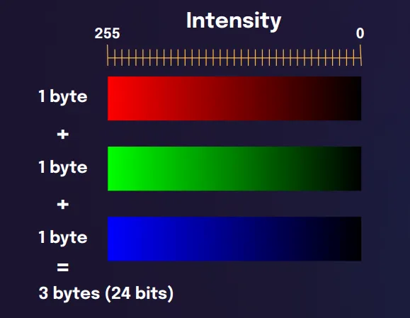

Welcome to the world of computers! Have you ever wondered how these amazing machines actually work? Well, one of the key things to understand is something called Binary. It might sound complicated, but don’t worry, we’ll break it down for you.

Binary is like a secret language that computers use to communicate with each other and perform tasks. It’s made up of just two digits: 0 and 1. Seems simple, right? But these two digits are incredibly powerful because they form the foundation of everything computers do.

In this blog, we’re going to explore how computers work using binary. We’ll start by looking at different ways numbers can be written, known as numeral systems. Then, we’ll dive into why computers specifically use binary and how they use it to represent numbers, letters, emojis, and even pictures. So, get ready to unlock the mysteries of binary and discover the inner workings of computers!

## Numeral Systems

Alright, let’s talk about how we write numbers. You might be used to seeing numbers written in a certain way, like 1, 2, 3, and so on. But did you know there are different ways to write numbers? These different ways are called numeral systems.

Think of numeral systems like different languages for numbers. Just like people from different countries speak different languages, computers can understand different numeral systems.

Here are some of the main numeral systems:

### Unary
Imagine counting on your fingers, where each finger represents one unit. Unary is like that, but instead of fingers, we use a single symbol, typically “1”, to represent each unit. While it might seem straightforward, unary can get cumbersome for large numbers. For example, representing the number 5 would require writing “11111”, which can quickly become impractical.

### Decimal
Decimal is the system we use in our everyday lives. It’s based on the number 10, and it uses ten symbols from 0 to 9. Each position in a decimal number represents a power of 10. For example, in the number 365, the “3” represents 3 hundreds, the “6” represents 6 tens, and the “5” represents 5 ones. Decimal is intuitive for humans because we have ten fingers, but it’s not the most efficient system for computers.

### Binary
Binary is the language of computers. It only uses two symbols: 0 and 1. This might seem limited compared to decimal, but it’s incredibly powerful for electronic devices because it’s easy to represent with switches that can be either on (1) or off (0). In binary, each position represents a power of 2. For example, the binary number `1010` represents 1 eight, 0 fours, 1 two, and 0 ones, which equals 10 in decimal.

### Octal
Octal is based on the number 8, so it uses eight symbols from 0 to 7. Octal numbers are often used to represent groups of three binary digits, making it easier to read and write binary numbers in a more compact form.

### Hexadecimal
Hexadecimal is based on the number 16, so it uses sixteen symbols: 0–9 and then A–F. Hexadecimal is widely used in computing because it’s a convenient way to represent binary numbers in a more compact form. Each hexadecimal digit corresponds to four binary digits, making it easier for humans to work with large binary numbers. For example, the binary number `11011001` can be represented as `D9` in hexadecimal.

## Why Computers Use Binary?

Ever wondered why computers speak in binary, using just 0s and 1s? Well, let’s break it down.

Imagine you’re building a machine that can do calculations and make decisions. You need a way for this machine to communicate internally. Binary is the perfect choice because it’s simple and works well with the electronic components inside computers.

Computers are made up of tiny switches called transistors. These switches can be either on or off, represented by 1 for on and 0 for off. With just these two states, we can represent all kinds of information and instructions.

Another reason for using binary is its reliability. With just two states, it’s easier to distinguish between different signals, reducing the chances of errors.

Additionally, binary aligns perfectly with the logic gates that form the building blocks of computer circuits. These gates perform operations like AND, OR, and NOT, which are the foundation of computer processing. Binary simplifies these operations, making them faster and more efficient.

## How Computers Use Binary to Represent Numbers?

Now that we understand why computers love binary, let’s explore how they use it to represent numbers. Remember, in binary, we only have two digits: 0 and 1. But with just these two digits, computers can work wonders!

Imagine you have a row of switches, each switch representing a digit in a binary number. When a switch is on, it represents a “1”, and when it’s off, it represents a “0”. So, if we have four switches like this, we can represent numbers from 0 to 15:

- `0000` (0 in decimal)
- `0001` (1 in decimal)
- `0010` (2 in decimal)
- `0011` (3 in decimal)
- and so on, up to
- `1111` (15 in decimal)

Each switch in this row represents a power of 2. The first switch represents 2⁰ (which is 1), the second switch represents 2¹ (which is 2), the third switch represents 2² (which is 4), and so on.

When we turn on or off these switches, we can represent any number using binary. For example, if we turn on the first and third switches (which represent 1 and 4 respectively), we get `0101`, which is 5 in decimal.

Inside a computer’s memory, there are millions of these tiny switches working together to represent numbers. When you type a number on your keyboard, the computer converts it into binary and stores it in its memory using these switches. Then, when you ask the computer to do some math, it reads these binary numbers, performs the calculations using its electronic circuits, and gives you the answer in binary, which is then converted back to decimal for you to understand.

## How Computers Use Binary to Represent Characters and Emojis?

Just like how computers use binary to represent numbers, they also use it to represent characters and emojis. But how does binary code turn into letters, symbols, and smiley faces?

Inside a computer’s memory, each character or emoji is assigned a unique number. This number is then represented in binary form using a specific coding scheme, such as ASCII or Unicode.

Let’s take ASCII as an example. In ASCII (which stands for American Standard Code for Information Interchange), each character — like letters, numbers, punctuation marks, and control characters — has a corresponding numeric value.

For instance, the letter ‘A’ is represented by the number 65 in decimal. In binary, this is `01000001`. Similarly, the number 33 in decimal corresponds to the exclamation mark ‘!’ in ASCII, which in binary is `00100001`.

So, when you type the letter ‘A’ on your keyboard, the computer translates it into binary using the ASCII code (or another coding scheme), and then stores it in its memory using binary.

Emojis work in a similar way. Unicode, a more modern coding standard, assigns unique numbers to characters and symbols from all languages and cultures, including emojis. For example, the emoji with the smiling face “😀” has a Unicode number associated with it, and this number is represented in binary in the computer’s memory.

When you send an emoji in a text message or use it in a document, the computer converts it into binary using the Unicode encoding, and then stores and displays it accordingly.

## How Computers Use Binary to Represent Images?

Have you ever wondered how your computer displays images on the screen? It’s all thanks to binary magic! Let’s see how it works.

Images are made up of tiny dots called pixels. Each pixel can be a different color, and computers use binary to represent these colors.

In a typical image file, like a JPEG or PNG, each pixel’s color is represented by a combination of numbers that stand for its red, green, and blue components. These numbers are usually in the range of 0 to 255, where 0 represents no color (black) and 255 represents the maximum intensity of that color (white).

Now, let’s break it down further. Each color component (red, green, and blue) is represented by 8 bits in binary. This means there are 256 possible shades for each color (2⁸ = 256).

For example, let’s say we have a pixel with the color red. In binary, this might be represented as `11111111` (8 bits all set to 1), indicating the maximum intensity of red. A pixel with no red at all might be represented as `00000000` (8 bits all set to 0), indicating no red.

Similarly, green and blue components of each pixel are represented in binary as well. So, combining these three binary numbers for each pixel gives us the full color of that pixel.

When your computer displays an image, it reads these binary numbers from the image file and then converts them into colors that your screen can show. It does this millions of times for each pixel in the image, creating the beautiful pictures you see on your screen.
