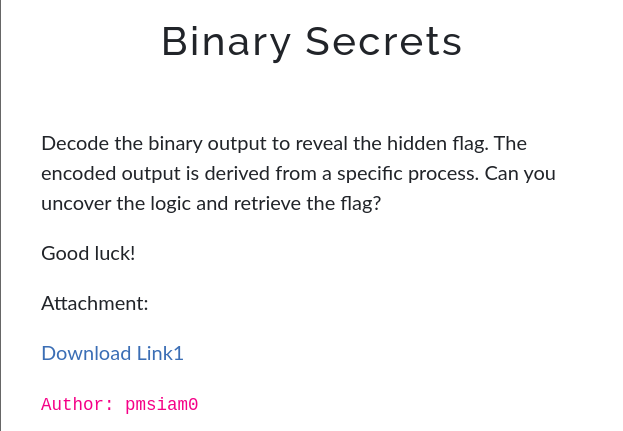
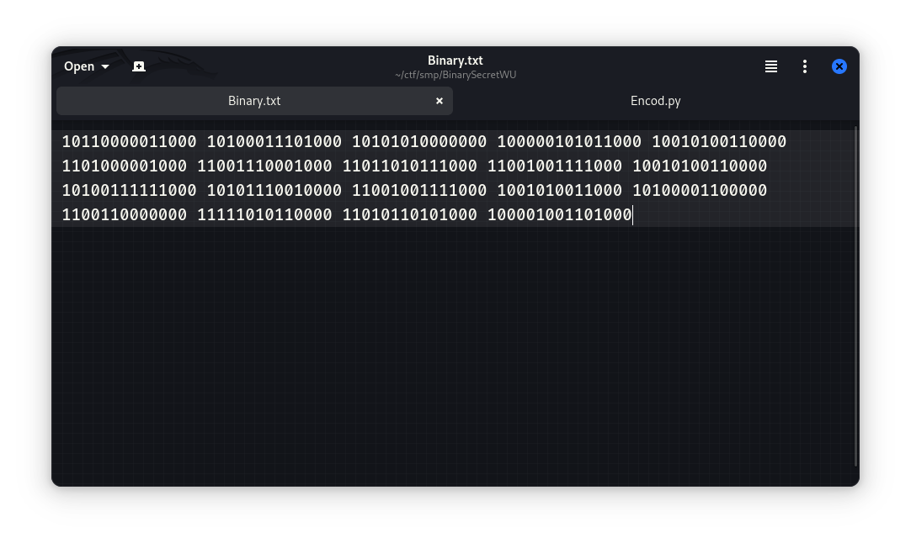
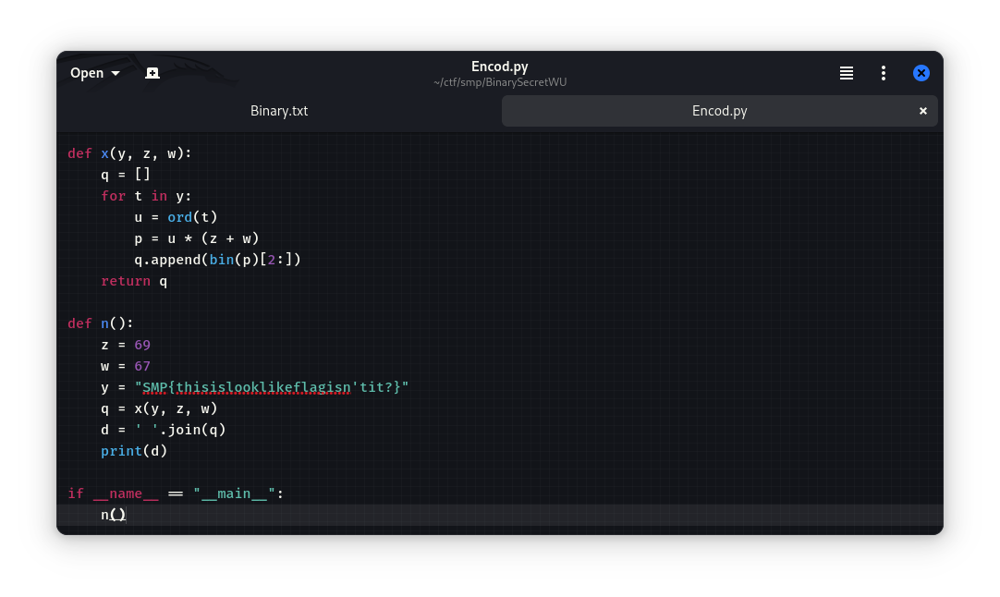

### Challenge description


The challenge provided two files:

1. **Binary.txt** - A file containing binary-encoded data.
    

2. **Encode.py** - A Python script that encodes text into binary based on a specific formula.
    
    

### Analyzing the `Encode.py` File

The **Encode.py** script contains two functions:

- `x(y, z, w)`:
    
    This function takes a string `y`, two integers `z` and `w` as input. Then the function multiplies the ASCII value of each character in the string `y` by a fixed number and converts the result into binary using `bin(p)[2:]`.
    
    - The fixed number is `(z + w) = 69 + 67 = 136`.
    - **Example:** If the character is `A` (ASCII value 65), the script calculates `65 * 136 = 8840` and converts it to binary: `10001010001000`.

- `n()`:
    
    This function takes the flag, encodes it into binary using the function `x(y, z, w)`, and prints the result.
    

### Writing the Decoding Script

Using the reverse logic, I wrote a decoding script:

```python
# Decoding the binary data
def decode(binary_data, z, w):
    decoded_text = ""
    for binary_value in binary_data.split():
        # Convert binary to decimal
        decimal_value = int(binary_value, 2)
        # Reverse the encoding formula to get the ASCII value
        ascii_value = decimal_value // (z + w)
        # Convert ASCII value to character
        decoded_text += chr(ascii_value)
    return decoded_text

# Input from Binary.txt
binary_data = """10110000011000 10100011101000 10101010000000 100000101011000 10010100110000
1101000001000 11001110001000 11011010111000 11001001111000 10010100110000 10100111111000
10101110010000 11001001111000 1001010011000 10100001100000 1100110000000 11111010110000
11010110101000 100001001101000"""

# Constants from Encode.py
z = 69
w = 67

# Decoding the binary data
flag = decode(binary_data, z, w)
print("Flag:", flag)

```

If you’re a noob like me, then you can also use ChatGPT to write this script.

After running the script, it decoded the binary data and revealed the flag:

**Flag:**  `SMP{F1ag_FOR_#L0ve}`