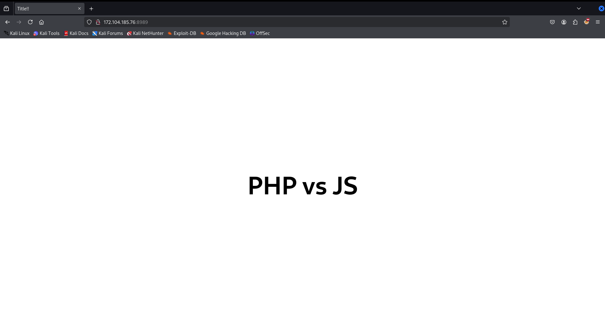
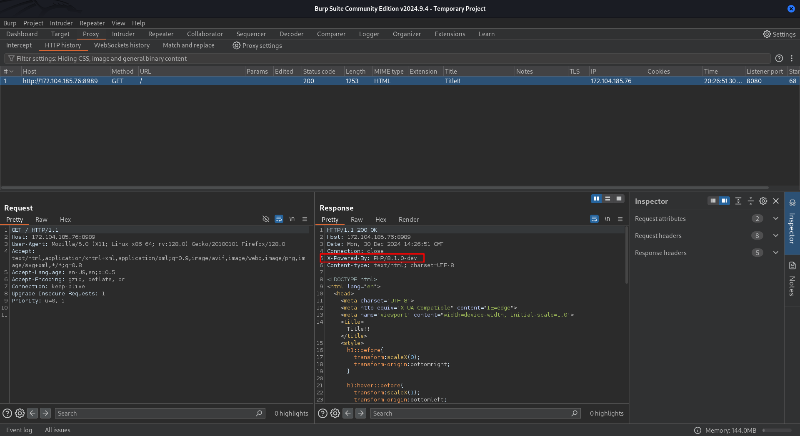
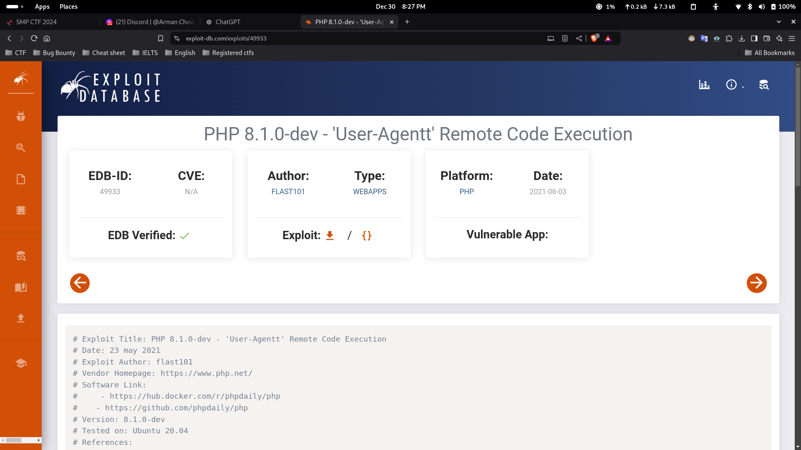
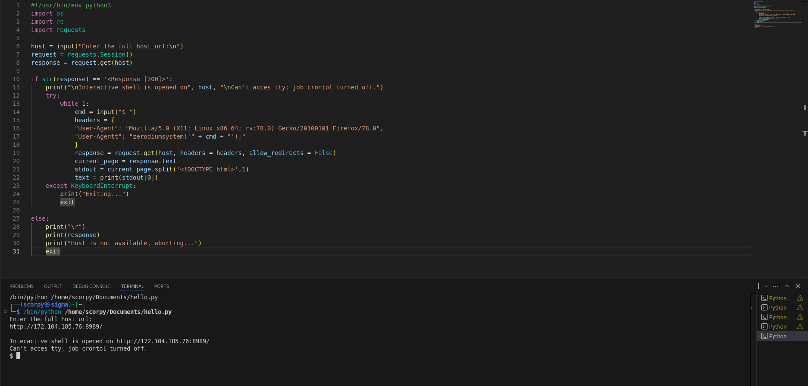
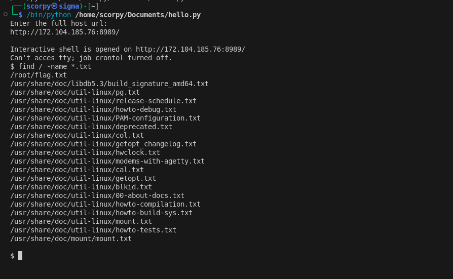
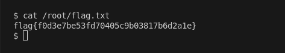

### Challenge Description

The challenge provided a website URL and the hint: 

*"Test your eyes. By the way, PHP is the best programming language."* 

When I visited the site, it displayed a heading: **"PHP VS JS"** with a sliding background effect, but I couldn’t find any obvious clues or useful information.

### Enumeration

I started by viewing the source code of the site and inspecting it. The HTML file only contained an `<h1>` tag, and the CSS file had styling for the hover effect. Both files were simple, with no useful information or hidden clues.

Next, I inspected the requests and responses of the site using **Burp Suite**. In the response headers, I noticed a line that said:

`X-Powered-By: PHP/8.1.0-dev.`

This caught my attention because the server’s PHP version seemed suspicious.

### Exploit

I searched online for **"PHP/8.1.0-dev exploit"** and found a known vulnerability listed on **Exploit-DB**. 

The exploit provided a script to take advantage of this specific PHP version. I downloaded the script, ran it in **VS Code**, and gained an **interactive shell** to the server.

Once I had access to the server through the shell, I ran the command `find / -name *txt` to locate any text files.

 This revealed a file named `/root/flag.txt`. Using the `cat` command, I viewed the content of the file and successfully retrieved the flag.

