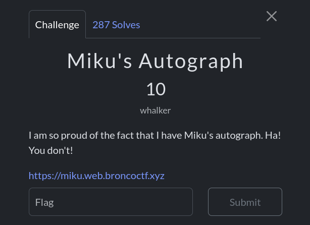
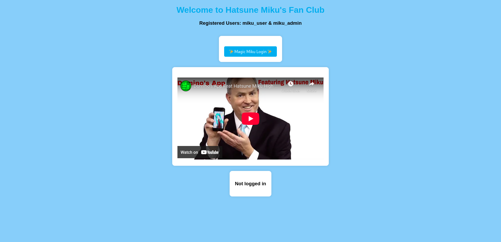
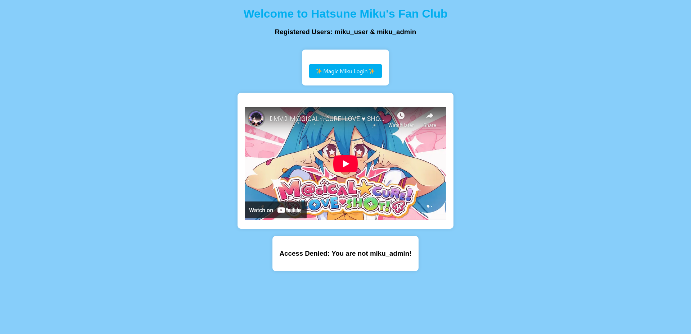
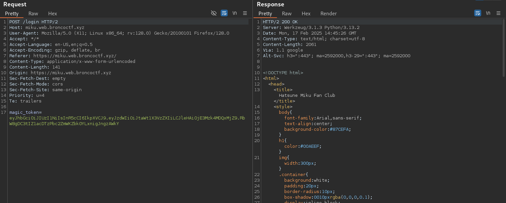
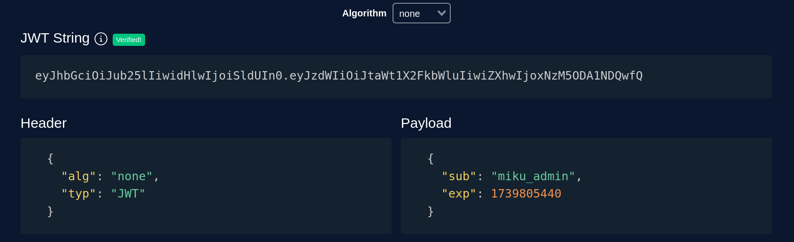
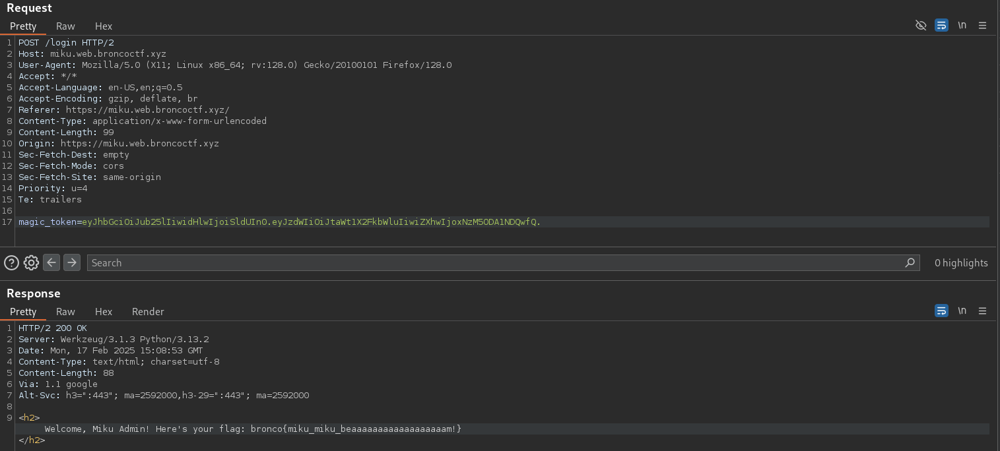

When I visited the challenge website, I found a **Hatsune Miku Fan Club** page. It showed that two users were registered:
- **miku_user**  
- **miku_admin**  

There was also a **"Magic Miku Login"** button.

I clicked the **"Magic Miku Login"** button and got this message:

> **Access Denied: You are not miku_admin!**

This means I need to **change my role** from **miku_user** to **miku_admin** to access the flag.

I used **Burp Suite** to analyze the login request. The server responded with a **JWT (JSON Web Token)**:

To change my user role, I went to **token.dev** and edited the token:

1. **Change "sub" (subject)** → from `"miku_user"` to `"miku_admin"`
2. **Change "alg" (algorithm)** → from `"HS256"` to `"none"`

Add a **"."** at the end to keep it valid

After editing the JWT, I replaced it in the request and tried logging in again.

🎉 **Success! I got the flag!** 🎉
