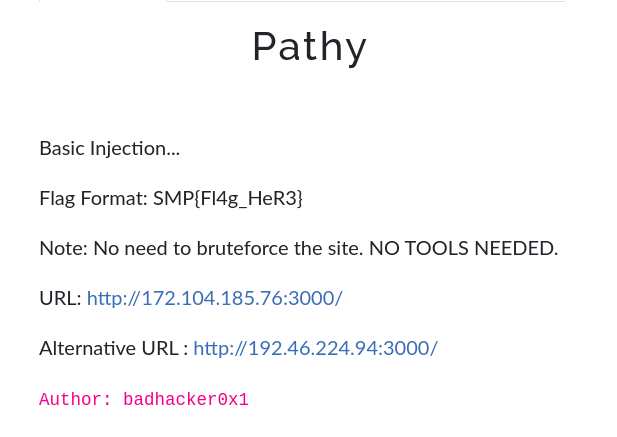
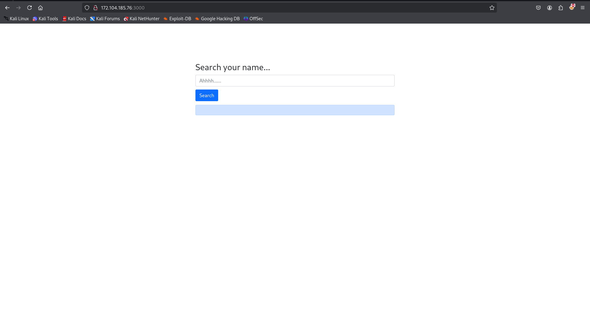
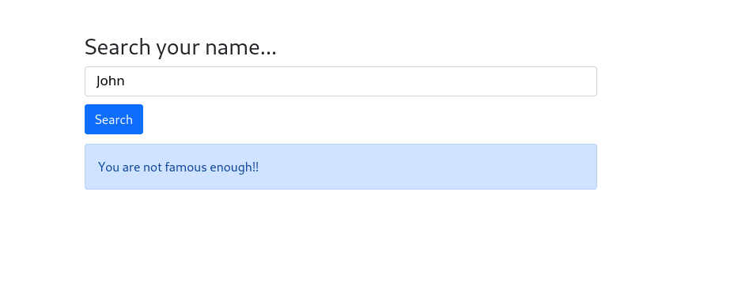
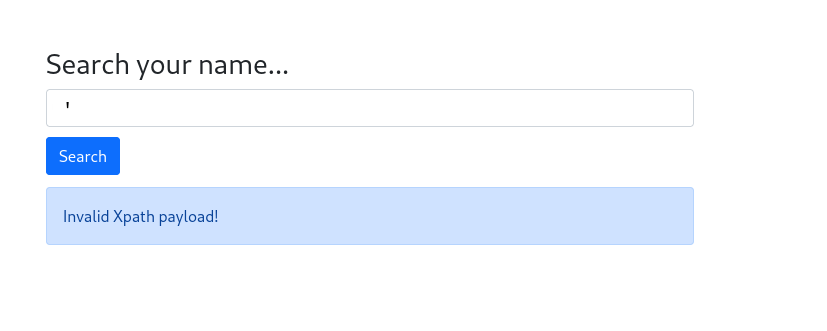
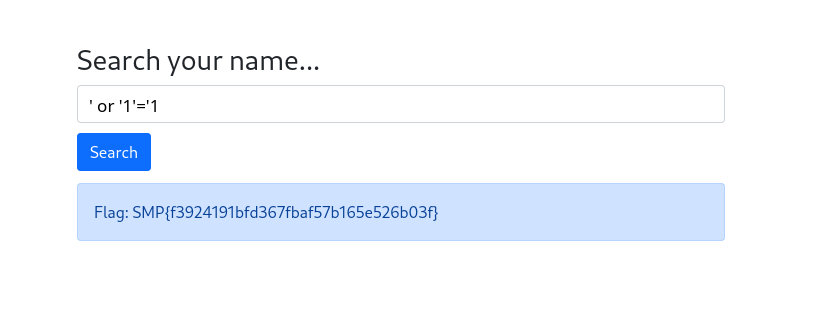

### Challenge description



We were given a website URL and a hint in the description:

> "Basic Injection... No need to bruteforce the site. No tools needed."

## Let’s visit the website:



The website had a search input field. When I searched for a random name, it showed this message:



### Testing for Vulnerabilities

Since the challenge mentioned **basic injection**, I decided to test if the input field was vulnerable to injections.

- First, I entered a single quote (`'`) in the input field.
- The response was:**"Invalid Xpath payload!"**



This error revealed that the site was likely vulnerable to **XPath Injection**. XPath is used to query XML data, and improper input handling can lead to exploitation.

I searched **XPath Injection** on Google to understand how it works. I learned that by using specially crafted inputs, we can bypass the query logic and trick the system into returning sensitive information.

Based on my research, I tried the payload:

```bash
' or '1'='1
```

- `' or '1'='1` is a condition that always evaluates to **true**, bypassing the logic of the query.

I entered the payload into the input field and clicked the search button. This time, instead of the **"You are not famous enough"** message, it displayed the **flag!**



